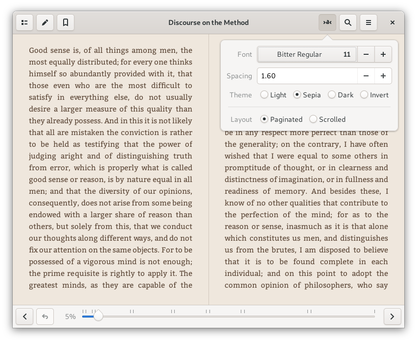
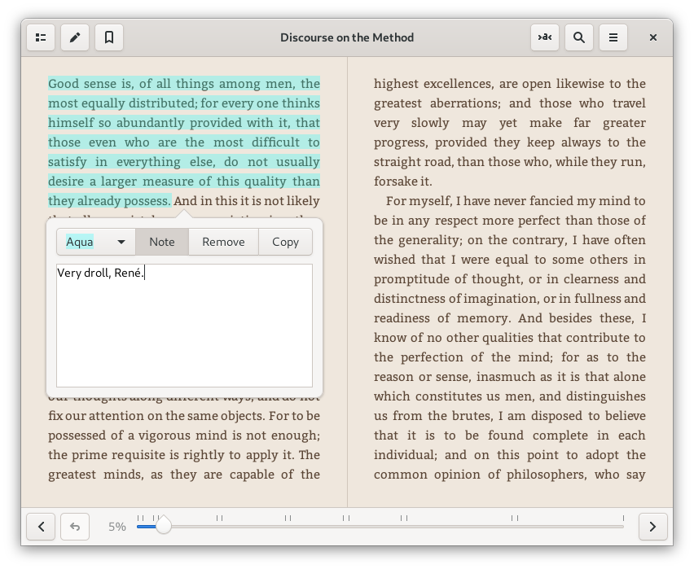
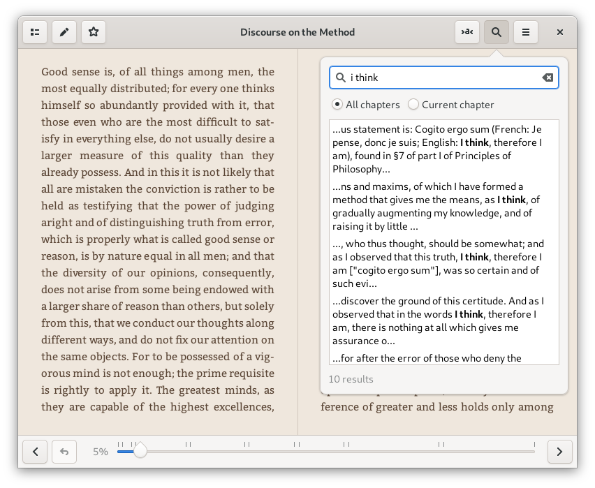

# Foliate

A simple and modern GTK eBook viewer, built with [GJS](https://gitlab.gnome.org/GNOME/gjs) and [Epub.js](https://github.com/futurepress/epub.js/).



Website: https://johnfactotum.github.io/foliate/

## Features

- View EPUB files
- Two-page view and scrolled view
- Customize font and line-spacing
- Light, sepia, dark, and invert mode
- Reading progress slider with chapter marks
- Bookmarks and annotations
- Find in book
- Quick dictionary lookup
- Touchpad gestures: use two-finger swipe to turn the page

## Installation

### Flatpak

<a href='https://flathub.org/apps/details/com.github.johnfactotum.Foliate'></a>

### Distribution packages

For Arch Linux users, two packages are available on the AUR: [`foliate`](https://aur.archlinux.org/packages/foliate/) (stable version), [`foliate-git`](https://aur.archlinux.org/packages/foliate-git/) (Git version)

For Void Linux users, foliate is available in Void's official repository. Install using xbps: `xbps-install -S foliate`

### Install manually from source

First, you'll need the following dependencies:
- `gjs`
- `webkit2gtk`
- `libsoup`
- `meson`

Then run the follwing commands:

```bash
meson build --prefix=/usr
cd build
ninja
sudo ninja install
```

To uninstall, run:

```bash
sudo ninja uninstall
```

### Build and run from source without installing

You will need the same dependencies listed in [this section](#install-manually-from-source).

The following commands will build Foliate and install it inside a directory:

```bash
meson build --prefix=$PWD/fakeprefix
ninja -C build
ninja -C build install
GSETTINGS_SCHEMA_DIR=$PWD/fakeprefix/share/glib-2.0/schemas ./fakeprefix/bin/com.github.johnfactotum.Foliate
```

## Screenshots

Dictionary:


Annotations:




Find in book:



Dark mode:


Book metadata display:


---

**Note:** three JavaScript libraries are bundled in this software:

- [Epub.js](https://github.com/futurepress/epub.js/), which is licensed under [FreeBSD](https://github.com/futurepress/epub.js/blob/master/license). The included file is patched to fix [futurepress/epub.js#942](https://github.com/futurepress/epub.js/issues/942)
- The minified version of [JSZip](https://stuk.github.io/jszip/), which is dual-licensed. You may use it under the MIT license or the GPLv3 license. See [LICENSE.markdown](https://github.com/Stuk/jszip/blob/master/LICENSE.markdown)
- A browserified version of [Cheerio](https://cheerio.js.org/), which is licensed under [MIT](https://github.com/cheeriojs/cheerio/blob/master/LICENSE). Cheerio is used to parse and extract data from Wiktionary
