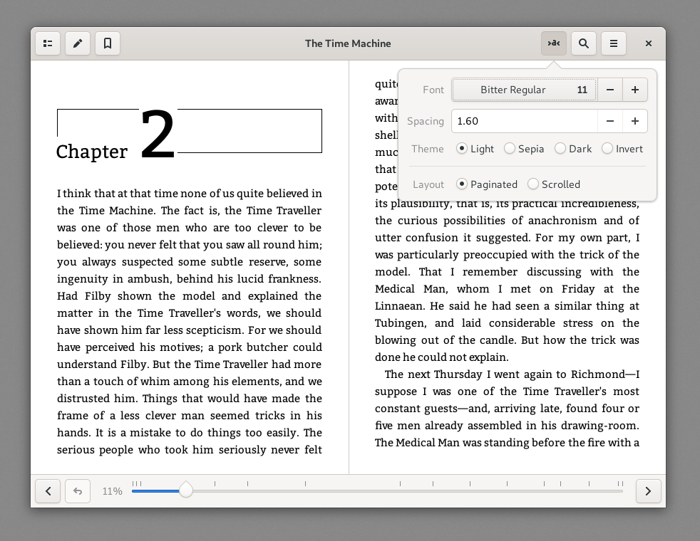

# Foliate
Foliate is a simple and modern eBook viewer for the Linux desktop, built with [GJS](https://gitlab.gnome.org/GNOME/gjs) and [Epub.js](https://github.com/futurepress/epub.js/).



## Features
- View eBooks in the EPUB format
    - Two-page view and scrolled view
    - Customize font and line-spacing
    - Light, sepia, dark, and invert mode
    - Reading progress slider with chapter marks
- Bookmarks and annotations
- Find in book
- Quick dictionary lookup powered by [Wiktionary](https://en.wiktionary.org/)


## Installation
### Install manually from source
First, you'll need the following dependencies:
- `gjs`
- `webkit2gtk`
- `libsoup`
- `meson`

Then run the follwing commands:
```bash
git clone https://github.com/johnfactotum/foliate.git
cd foliate
meson build --prefix=/usr
cd build
ninja
sudo ninja install
```

To uninstall, run
```bash
sudo ninja uninstall
```
