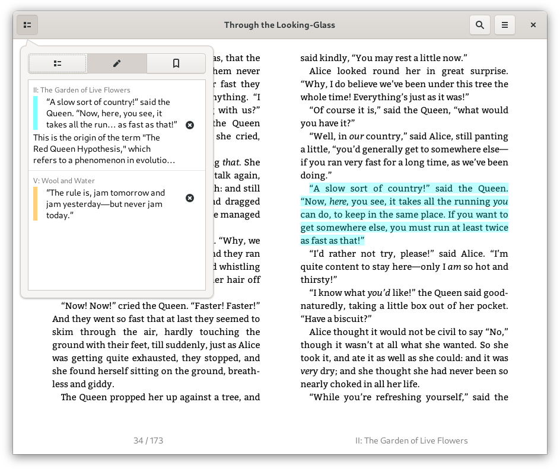

# Foliate
A simple and modern GTK eBook viewer, built with [GJS](https://gitlab.gnome.org/GNOME/gjs) and [Epub.js](https://github.com/futurepress/epub.js/).


Website: https://johnfactotum.github.io/foliate/

## Features
- View EPUB files
- Two-page view and scrolled view
- Customize font and line-spacing
- Light, sepia, dark, and invert mode
- Reading progress slider with chapter marks
- Bookmarks and annotations
- Find in book
- Quick dictionary lookup

## Installation
### Install manually from source
First, you'll need the following dependencies:
- `gjs`
- `webkit2gtk`
- `libsoup`
- `meson`

Then run the follwing commands:
```bash
git clone https://github.com/johnfactotum/foliate.git
cd foliate
meson build --prefix=/usr
cd build
ninja
sudo ninja install
```

To uninstall, run
```bash
sudo ninja uninstall
```

## Screenshots

Dictionary:


Annotations:




Find in book:


Dark mode:


Book metadata display:


