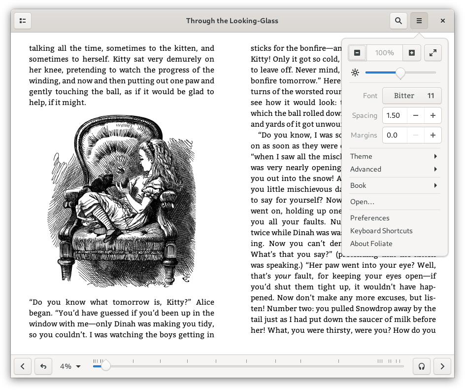
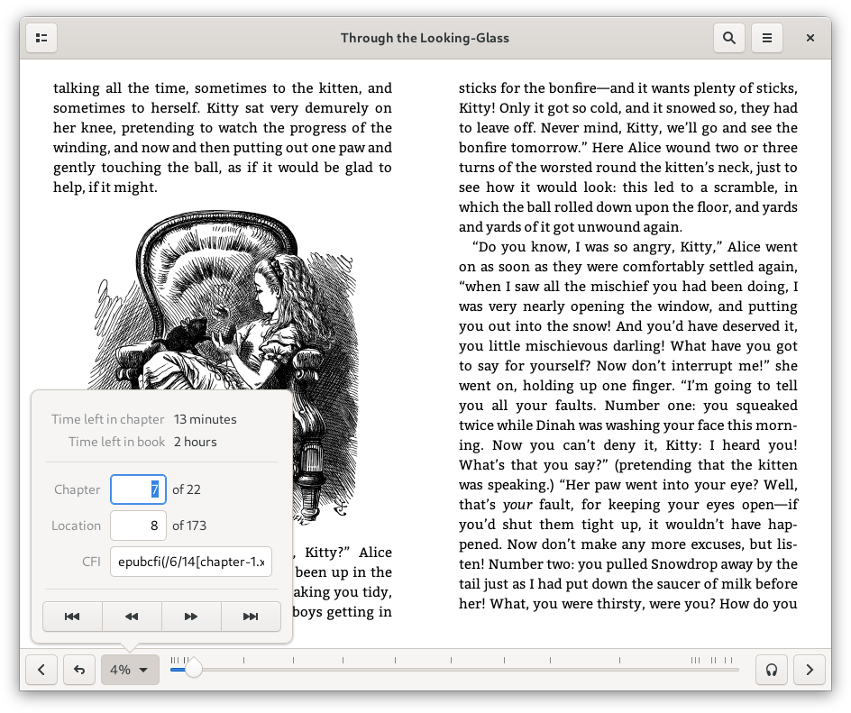

# Foliate

A simple and modern GTK eBook viewer, built with [GJS](https://gitlab.gnome.org/GNOME/gjs) and [Epub.js](https://github.com/futurepress/epub.js/).


Website: https://johnfactotum.github.io/foliate/

Documentation: https://github.com/johnfactotum/foliate/wiki

<a href="https://flathub.org/apps/details/com.github.johnfactotum.Foliate"></a>

<a href="https://snapcraft.io/foliate"></a>

## Features

- View .epub, .mobi, .azw, and .azw3 files in two-page view or scrolled view
- Customize font, line-spacing, margins, and brightness
- Light, sepia, dark, and invert mode, or add your own custom themes
- Reading progress slider with chapter marks
- Bookmarks and annotations
- Find in book
- Quick dictionary lookup with [Wiktionary](https://en.wiktionary.org/), [Wikipedia](https://en.wikipedia.org/), and `dictd`, or translate text with Google Translate
- Touchpad gestures—use two-finger swipe to turn the page
- Basic text-to-speech support with [eSpeak NG](https://github.com/espeak-ng/espeak-ng) and [Festival](http://www.cstr.ed.ac.uk/projects/festival/)

## Installation

### Distribution packages

|Distro|Package Name/Link|Maintainer|
|:----:|:----:|:----:|
| Arch Linux | [`foliate`](https://www.archlinux.org/packages/community/x86_64/foliate/) | [Jerome Leclanche](https://github.com/jleclanche) |
| Fedora | [`foliate`](https://src.fedoraproject.org/rpms/foliate) | [Artem Polishchuk](https://github.com/tim77) |
| Manjaro | `foliate` | |
| Ubuntu (Snap) | [`foliate`](https://snapcraft.io/foliate) | [Merlijn Sebrechts](https://github.com/galgalesh) and [John Factotum](https://github.com/johnfactotum) |
| Ubuntu (PPA) | `foliate`<br>[Stable Releases](https://launchpad.net/~apandada1/+archive/ubuntu/foliate)<br>`com.github.johnfactotum.foliate`<br>[Daily Buillds](https://launchpad.net/~apandada1/+archive/ubuntu/foliate-daily) | [Archisman Panigrahi](https://github.com/apandada1) |
| Void Linux | [`foliate`](https://github.com/void-linux/void-packages/tree/master/srcpkgs/foliate) | [Lorem](https://github.com/not-chicken) |

Debian packages can be downloaded from the [releases](https://github.com/johnfactotum/foliate/releases) page.

[](https://repology.org/project/foliate/versions)

#### Optional dependencies

For Mobipocket (.mobi) and Kindle File Format (.azw, .azw3) support, you would need Python (2.7 or >= 3.4).

Auto-hyphenation is done using CSS hyphenation. To enable CSS hyphenation in WebKitGTK, you will need to install the hyphenation rules, e.g., `hyphen-en` for English, `hyphen-fr` for French, etc.

For offline dictionary support, install `dictd`.

For text-to-speech support, install `espeak-ng`, or `festival`, and packages for the individual voices.

To enable spellchecking for notes, `gspell` is requried.

### Building manually from source

The following dependencies are required for building:

- `meson (>= 0.40)`
- `gettext`

The following are runtime requirements:

- `gjs (>= 1.52)`
- `webkit2gtk`

To install, run the following commands:

```bash
meson build --prefix=/usr
ninja -C build
sudo ninja -C build install
```

To uninstall, run

```bash
sudo ninja -C build uninstall
```

#### Build and run from source without installing

The following commands will build Foliate and install it inside a directory:

```bash
meson build --prefix=$PWD/run
ninja -C build
ninja -C build install
```

To run the application, you'll need to set the schema directory for GSettings:

```bash
GSETTINGS_SCHEMA_DIR=$PWD/run/share/glib-2.0/schemas ./run/bin/com.github.johnfactotum.Foliate
```

#### Building a Debian/Ubuntu Package

```bash
sudo apt install build-essential debhelper meson gettext
dpkg-buildpackage -us -uc -nc
```

### Flatpak

#### Flathub

Foliate is available on [Flathub](https://flathub.org/apps/details/com.github.johnfactotum.Foliate).

#### Building Flatpaks manually

##### Using Gnome Builder

Open [Gnome Builder](https://wiki.gnome.org/Apps/Builder), choose "Clone Repository…", and follow the instructions. After cloning the project, hit Ctrl+F5 to build and run Foliate.

##### Using `flatpak-builder`

```bash
flatpak-builder --force-clean --install --user build com.github.johnfactotum.Foliate.json
```

### Snap

Foliate is available on the [Snap Store](https://snapcraft.io/foliate).

#### Daily builds

You can test out the latest code in this repository using the `edge` channel of the snap. Run `snap install --edge foliate` to install the latest build from master. (`snap refresh --edge foliate` if you already have the snap installed)

#### Building the snap manually

You can build the snap manually using [snapcraft](https://snapcraft.io/snapcraft). Install snapcraft and run `snapcraft` in the root of this repository.

## Screenshots

Primary menu:



Navigation:



Lookup:


Annotations:


Skeuomorphic mode:


Dark mode:


Book metadata display:


Alternative sidebar UI:


---

**Note:** Three JavaScript libraries are bundled in this software:

- [Epub.js](https://github.com/futurepress/epub.js/), which is licensed under [FreeBSD](https://github.com/futurepress/epub.js/blob/master/license). The included file is patched with various fixes and enhancements (see [git history](https://github.com/johnfactotum/foliate/commits/master/src/assets/epub.js) for details).
- The minified version of [JSZip](https://stuk.github.io/jszip/), which is dual-licensed. You may use it under the MIT license or the GPLv3 license. See [LICENSE.markdown](https://github.com/Stuk/jszip/blob/master/LICENSE.markdown)
- [libarchivejs](https://github.com/nika-begiashvili/libarchivejs), which is MIT licensed. It is a WASM port of the popular [libarchive](https://github.com/libarchive/libarchive) C library.

This software also includes parts from [KindleUnpack](https://github.com/kevinhendricks/KindleUnpack), which is licensed under GPL-3.0.
