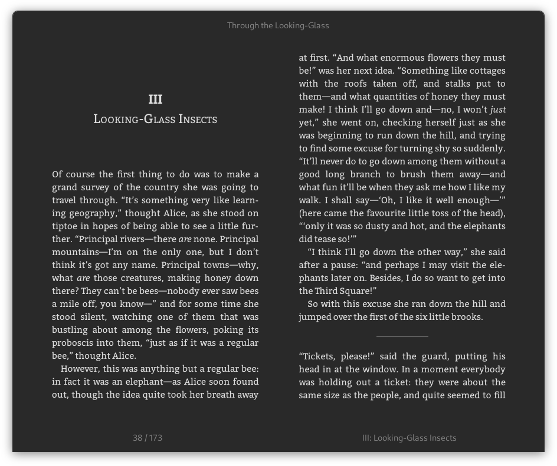

# Foliate

Read books in style.


## Installation

### Run Time Dependencies

- `gjs` (>= 1.76)
- `gtk4` (>= 4.12)
- `libadwaita` (>= 1.6; `gir1.2-adw-1` in Debian-based distros)
- `webkitgtk-6.0` (`webkitgtk6.0` in Fedora; `gir1.2-webkit-6.0` in Debian-based distros)

#### Optional Dependencies

To enable auto-hyphenation, you will need to install hyphenation rules, e.g., `hyphen-en` for English, `hyphen-fr` for French, etc. (which strictly speaking are optional dependencies for WebkitGTK, not Foliate itself).

For text-to-speech support, install `speech-dispatcher` and output modules such as `espeak-ng`.

If installed, `tracker` (>= 3; `gir1.2-tracker-3.0` in Debian-based distros) and `tracker-miners` can be used to track the locations of files.

### Obtaining the Source

The repo uses git submodules. Before running or installing, make sure you clone the whole thing with `--recurse-submodules`:

```
git clone --recurse-submodules https://github.com/johnfactotum/foliate.git 
```

Or download the tarball (the `.tar.xz` file) from the [Releases](https://github.com/johnfactotum/foliate/releases) page.

### Run without Building or Installing

It's possible to run directly from the source tree without building or installing. Simply run

```
gjs -m src/main.js
```

This can be useful if you just want to quickly try out Foliate or test a change.

But note that this will run it without using GSettings, so settings will not be saved. To solve this, you can compile the schema by running

```
glib-compile-schemas data
```

Then you can set the schema directory when running the app:

```
GSETTINGS_SCHEMA_DIR=data gjs -m src/main.js
```

### Building and Installing from Source

The following dependencies are required for building:

- `meson` (>= 0.59)
- `pkg-config`
- `gettext`

To install, run the following commands:

```
meson setup build
sudo ninja -C build install
```

To uninstall, run

```
sudo ninja -C build uninstall
```

#### Installing to a Local Directory

By default Meson installs to `/usr/local`. You can install without root permissions by choosing a local prefix, such as `$PWD/run`:

```
meson setup build --prefix $PWD/run
ninja -C build install
```

You can then run it with

```
GSETTINGS_SCHEMA_DIR=run/share/glib-2.0/schemas ./run/bin/foliate
```

### Flatpak

Foliate is available on [Flathub](https://flathub.org/apps/details/com.github.johnfactotum.Foliate).

For developement with Flatpak, use [GNOME Builder](https://wiki.gnome.org/Apps/Builder) to open and run the project.

### Snap

Foliate is available on the [Snap Store](https://snapcraft.io/foliate). To install:

```
sudo snap install foliate
```

## Screenshots




## License

This program is free software: you can redistribute it and/or modify it under the terms of the [GNU General Public License](https://www.gnu.org/licenses/gpl.html) as published by the Free Software Foundation, either version 3 of the License, or (at your option) any later version.

The following JavaScript libraries are bundled in this software:

- [foliate-js](https://github.com/johnfactotum/foliate-js), which is MIT licensed.
- [zip.js](https://github.com/gildas-lormeau/zip.js), which is licensed under the BSD-3-Clause license.
- [fflate](https://github.com/101arrowz/fflate), which is MIT licensed.
- [PDF.js](https://github.com/mozilla/pdf.js), which is licensed under Apache License 2.0.

---

<a href="https://www.buymeacoffee.com/johnfactotum" target="_blank"></a>
