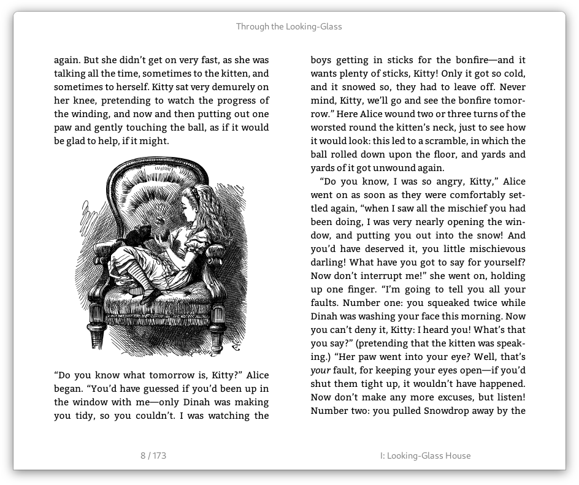

# Foliate
A simple and modern GTK eBook viewer, built with [GJS](https://gitlab.gnome.org/GNOME/gjs) and [Epub.js](https://github.com/futurepress/epub.js/).



Website: https://johnfactotum.github.io/foliate/

## Features
- View EPUB files
- Two-page view and scrolled view
- Customize font and line-spacing
- Light, sepia, dark, and invert mode
- Reading progress slider with chapter marks
- Bookmarks and annotations
- Find in book
- Quick dictionary lookup
- Touchpad gestures: use two-finger swipe to turn the page (on master branch; not released yet)

## Installation
### Flatpak
<a href='https://flathub.org/apps/details/com.github.johnfactotum.Foliate'></a>

### AUR
If you're using an Arch-like Linux distro, you can find the package ```foliate``` in your AUR helper or do the following:
```bash
git clone https://aur.archlinux.org/foliate.git
cd foliate
makepkg -si
```
To install the Git version, find the package ```foliate-git``` in your AUR helper or do the following:
```bash
git clone https://aur.archlinux.org/foliate-git.git
cd foliate
makepkg -si
```

### Install manually from source
First, you'll need the following dependencies:
- `gjs`
- `webkit2gtk`
- `libsoup`
- `meson`

Then run the follwing commands:
```bash
meson build --prefix=/usr
cd build
ninja
sudo ninja install
```

To uninstall, run
```bash
sudo ninja uninstall
```

## Screenshots

Dictionary:


Annotations:


Find in book:


Dark mode:


Book metadata display:


---

**Note:** three JavaScript libraries are bundled in this software:

- [Epub.js](https://github.com/futurepress/epub.js/), which is licensed under [FreeBSD](https://github.com/futurepress/epub.js/blob/master/license). The included file is patched to fix [futurepress/epub.js#942](https://github.com/futurepress/epub.js/issues/942)
- The minified version of [JSZip](https://stuk.github.io/jszip/), which is dual-licensed. You may use it under the MIT license or the GPLv3 license. See [LICENSE.markdown](https://github.com/Stuk/jszip/blob/master/LICENSE.markdown)
- A browserified version of [Cheerio](https://cheerio.js.org/), which is licensed under [MIT](https://github.com/cheeriojs/cheerio/blob/master/LICENSE). Cheerio is used to parse and extract data from Wiktionary
