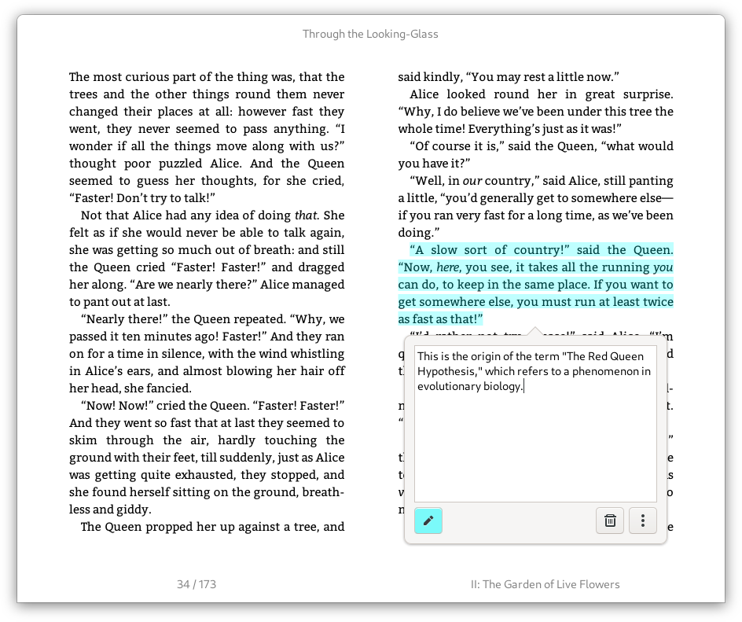
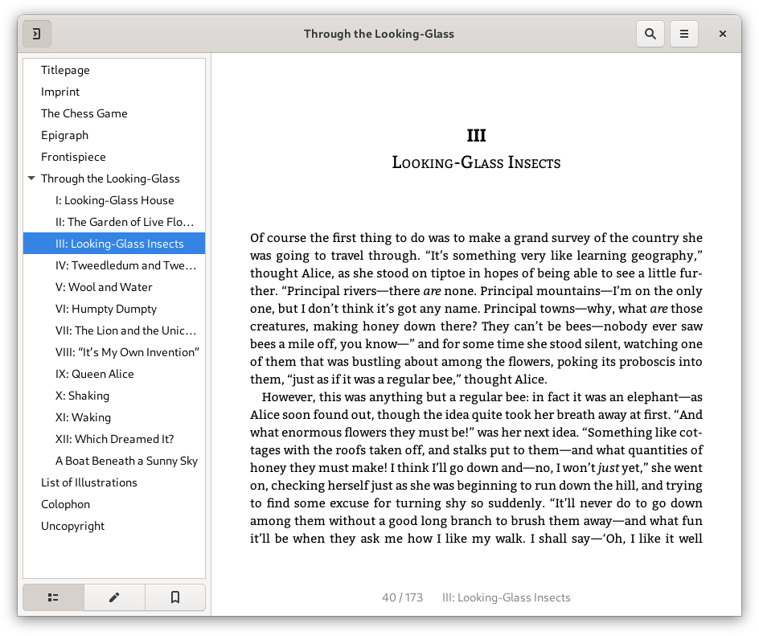

# Foliate

A simple and modern GTK eBook viewer, built with [GJS](https://gitlab.gnome.org/GNOME/gjs) and [Epub.js](https://github.com/futurepress/epub.js/).


Website: https://johnfactotum.github.io/foliate/

<a href="https://flathub.org/apps/details/com.github.johnfactotum.Foliate"></a>

## Features

- View EPUB files in two-page view or scrolled view
- Customize font, line-spacing, margins, and brightness
- Light, sepia, dark, and invert mode, or add your own custom themes
- Reading progress slider with chapter marks
- Bookmarks and annotations
- Find in book
- Quick dictionary lookup with [Wiktionary](https://en.wiktionary.org/), [Wikipedia](https://en.wikipedia.org/), and `dictd`, or translate text with Google Translate
- Touchpad gestures—use two-finger swipe to turn the page

## Installation

### Distribution packages

- Arch Linux (AUR): [`foliate`](https://aur.archlinux.org/packages/foliate/), [`foliate-git`](https://aur.archlinux.org/packages/foliate-git/)
- Fedora: `sudo dnf install foliate`
- Void Linux: `xbps-install -S foliate`


#### Optional dependencies

Auto-hyphenation is done using CSS hyphenation. To enbale CSS hyphenation in WebKitGTK, you will need to install the hyphenation rules, e.g., `hyphen-en` for English, `hyphen-fr` for French, etc.

For offline dictionary support, install `dictd`.

### Building manually from source

The following dependencies are required for building:

- `meson (>= 0.40)`
- `gettext`

The following are runtime requirements:

- `gjs (>= 1.52)`
- `webkit2gtk`

To install, run the following commands:

```bash
meson build --prefix=/usr
ninja -C build
sudo ninja -C build install
```

To uninstall, run

```bash
sudo ninja -C build uninstall
```

#### Build and run from source without installing

The following commands will build Foliate and install it inside a directory:

```bash
meson build --prefix=$PWD/run
ninja -C build
ninja -C build install
```

To run the application, you'll need to set the schema directory for GSettings:
```bash
GSETTINGS_SCHEMA_DIR=$PWD/run/share/glib-2.0/schemas ./run/bin/com.github.johnfactotum.Foliate
```

#### Building a Debian/Ubuntu Package

```bash
sudo apt install build-essential debhelper meson gettext
dpkg-buildpackage
```

### Flatpak

#### Flathub

Foliate is available on [Flathub](https://flathub.org/apps/details/com.github.johnfactotum.Foliate).

#### Building Flatpaks manually

##### Using Gnome Builder
Open [Gnome Builder](https://wiki.gnome.org/Apps/Builder), choose "Clone Repository…", and follow the instructions. After cloning the project, hit Ctrl+F5 to build and run Foliate.

##### Using `flatpak-builder`

```bash
flatpak-builder --force-clean --install --user build com.github.johnfactotum.Foliate.json
```

## Screenshots

Dictionary:


Annotations:




Find in book:


Dark mode:


Book metadata display:


Optional sidebar layout, with popup footnote:



---

**Note:** three JavaScript libraries are bundled in this software:

- [Epub.js](https://github.com/futurepress/epub.js/), which is licensed under [FreeBSD](https://github.com/futurepress/epub.js/blob/master/license). The included file is patched to fix [#76](https://github.com/johnfactotum/foliate/issues/76) and  [futurepress/epub.js#942](https://github.com/futurepress/epub.js/issues/942)
- The minified version of [JSZip](https://stuk.github.io/jszip/), which is dual-licensed. You may use it under the MIT license or the GPLv3 license. See [LICENSE.markdown](https://github.com/Stuk/jszip/blob/master/LICENSE.markdown)
- A browserified version of [Cheerio](https://cheerio.js.org/), which is licensed under [MIT](https://github.com/cheeriojs/cheerio/blob/master/LICENSE). The browserified version is produced by
```bash
npm install -g browserify
echo "window.cheerio = require('cheerio')" > index.js
browserify index.js > cheerio.js
```
